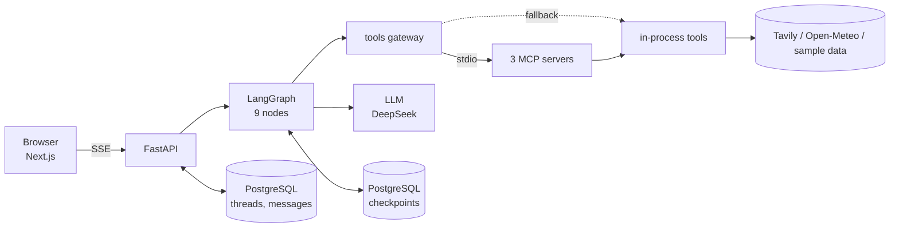

# Yatra AI: Overview Specification

**Version:** 3.0
**Date:** 2026-10-03
**Status:** Implemented. This overview describes what the repository does today. The first
version of this file (2026-09-29) was a plan written before the code existed; where the build
changed the plan, this version follows the code. Version 3.0 adds the model fallback chain and
the DeepEval agent evals with their CI job.

Detailed specs: `01-config`, `02-agents`, `03-tools-mcp`, `04-memory`, `05-api`, `06-tests`,
`07-evals`, `08-gate-ci`, `10-frontend`. The README is the entry point for readers.

---

## 1. What it is

A multi-agent travel planner. A traveller writes a request in plain language. A supervisor checks
it and picks which specialist agents to run. The agents gather flights, hotels and weather, work
out a budget and draft an itinerary. The run then stops and waits for a human to approve the plan
or reject it with feedback. A rejection produces a revised draft, up to a fixed number of times.

Features, all implemented and tested:

- Supervisor routing with an input guardrail that fails closed.
- Parallel research workers (flight, hotel, weather).
- Human-in-the-loop approval with LangGraph `interrupt()` and `Command(resume=...)`.
- A PostgreSQL checkpointer, so a paused plan survives an application restart.
- Real MCP servers (hotels, flights, weather) used through `langchain-mcp-adapters`, with an
  in-process fallback.
- A streaming API (Server-Sent Events) and a Next.js frontend.

## 2. Architecture

| Component | Technology | Purpose |
|---|---|---|
| API | FastAPI, Uvicorn, SSE | Streams progress, serves threads, resumes paused runs |
| Orchestration | LangGraph | Supervisor, parallel workers, interrupt and resume |
| Tools | MCP over stdio (FastMCP, `langchain-mcp-adapters`) with in-process fallback | Hotels via Tavily, weather via Open-Meteo, flights as sample data |
| Storage | PostgreSQL 15 or newer, psycopg 3 | Thread and message history, LangGraph checkpoints |
| LLM | DeepSeek (`deepseek:deepseek-flash`), with OpenAI `gpt-4.1-mini` and then DeepSeek as fallbacks | Supervisor, and itinerary revisions |
| Frontend | Next.js 15, TypeScript, Tailwind | Request form, live progress, approval page, results |
| Packaging | Docker, Docker Compose, `render.yaml` | Local stack and Render deployment |
| CI | GitHub Actions | Lint, tests with Postgres, image build, agent evals with a merge gate script, verify workflow |

## 3. Request flow

1. `POST /api/plan` with a message. The API creates or loads the thread and streams events.
2. The supervisor decides whether the request is a valid travel request, picks the workers and
   extracts the trip constraints.
3. The research workers run in parallel, then budget, then itinerary.
4. The human approval node calls `interrupt()`. The state goes to the Postgres checkpointer, the
   plan document is stored, and the stream ends with `approval_required`.
5. `PUT /api/threads/{id}/approve` resumes the run with the decision. Approval ends the run with
   a final response. A rejection needs feedback and goes through `revise` back to the itinerary,
   until the cap (`MAX_REVISIONS`, default 3) is reached.

The graph, routing and node details are in `02-agents`. The event names and status codes are in
`05-api`.

## 4. Data

- **Graph state** (`TravelState`) is described in `02-agents`. It is stored by the checkpointer.
- **Threads and messages** are two tables, described in `04-memory`. The plan document and the
  approval decision are stored in message metadata.
- There is no users table and no login. A thread's id is the only secret.

## 5. API

| Route | Purpose |
|---|---|
| `POST /api/plan` | Start a plan. Streams `thread`, `progress`, `plan`, optionally `approval_required`, then `done`, or one generic `error`. |
| `PUT /api/threads/{id}/approve` | Resume a paused plan. Streams the same way. |
| `GET /api/threads/{id}` | Thread, history, plan and approval state. |
| `GET /health` | Liveness and feature list. |
| `GET /ready` | Database check, plus MCP status for information. |

## 6. Model policy

| Use | Model |
|---|---|
| Runtime (supervisor, revisions) | `deepseek:deepseek-flash` |
| Fallback | `openai:gpt-4.1-mini` |
| Eval judge (no fallbacks) | `openai:gpt-4o-mini` |

The runtime model is wrapped with `.with_fallbacks(...)`. If a call to the primary raises, for
example on a timeout, a rate limit or an outage, the next model in `LLM_FALLBACK_MODELS` is tried.
The default list is `openai:gpt-4.1-mini,deepseek:deepseek-flash`. A model that repeats the primary
is dropped, so with the default primary the chain is DeepSeek, then OpenAI. If the primary is set to
`openai:gpt-4.1-mini`, the chain is OpenAI, then DeepSeek. A model without an API key is left out of
the chain with a warning. The chain is checked with fake
clients only: no call to a real DeepSeek or OpenAI endpoint has been made yet.

The config accepts four provider-prefixed ids: `deepseek:deepseek-flash`, `deepseek:deepseek-chat`
(a legacy name that DeepSeek is retiring), `openai:gpt-4.1-mini` and `openai:gpt-4o-mini`. Ids that
start with `claude-`, `gpt-4` or `gpt-5` and are not one of these are rejected with a clear error, and
any other id is "unknown". The reason is cost and reproducibility. Details are in `01-config`.

## 7. Quality gates (what exists)

- **Lint and types:** ruff and black (line length 100) on `src tests evals .github/scripts`, and
  pyright in strict mode on `src`.
- **Tests:** 394 tests (357 unit, 37 integration), 91.30% line coverage in the last full run. The
  integration tests need PostgreSQL. See `06-tests`.
- **CI:** `.github/workflows/ci.yml` runs lint, tests against a Postgres service and a Docker
  image build. `verify.yml` builds the compose stack, checks `/ready` and `/health`, runs the unit
  tests and builds the frontend.
- **Agent evals and the gate:** `evals/` runs the real graph on 15 golden tasks with DeepEval
  (Task Completion, Plan Quality, Plan Adherence, a custom plan judge) and three code checks
  (guardrail, routing, approval loop). `.github/scripts/eval_gate.py` turns the summary into an
  exit code, and the `agent-evals` job in `ci.yml` calls both on a pull request. The job skips
  without API keys, and it blocks a merge only after it is made a required status check. **No live
  score exists yet.** The older request-time judges in `src/evals/` (safety 0.95, factuality 0.90,
  budget 0.95) are plain prompts, are not wired into the graph and are not used by CI. See
  `07-evals` and `08-gate-ci`.

## 8. Not done, and not claimed

- Flights are sample data, labelled as such. There is no free flight-pricing API.
- The first-draft itinerary is built from a template. Only revisions use the LLM.
- No latency numbers are published. The original plan set targets (under 10 seconds per draft),
  but no measurement backs them, so they are not stated as results.
- The Docker image has not been built on the author's machine, and the application has not been
  run with a real LLM key from the browser. Both are covered by tests with fakes and by CI.
- SSE on Render's free tier is unverified.
- No live eval score has been recorded. The agent evals and the gate script are tested without a
  model and wired into CI. The one manual run with real keys failed before scoring (see section 7).
- The model fallback chain has not been exercised against real providers.
- On GitHub Actions, `CI Pipeline` and `Verify` passed on commit 808083d. The fixes made after it
  (key cleaning, dated goldens) have not been seen there yet.

## 9. Conventions

- Commits: Conventional Commits (`feat`, `fix`, `docs`, `test`, `refactor`, `chore`), ending with
  the attribution line the tooling adds.
- Python: Black and ruff at line length 100, type hints everywhere, async first, no secrets in
  code (environment variables only; see `.env.example`).
- Files: agents in `src/agents/`, tools in `src/tools/`, MCP servers in `src/mcp_servers/`, tests
  in `tests/unit/` and `tests/integration/`, specs in `specs/NN-name.spec.md`.
- Build-night reports from 2026-09-29 are kept in `docs/history/` and are not maintained.
