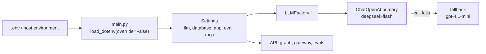

# Config & LLM Factory Specification

**Version:** 3.0
**Status:** Implemented. This spec describes `src/core/` (`config.py`, `llm.py`, `errors.py`,
`telemetry.py`) and the `.env` loading in `main.py`. The tests in `tests/unit/test_config.py`,
`test_llm_factory.py`, `test_telemetry.py` and `test_entrypoint.py` pin it. Version 3.0 adds the
model fallback chain (section 2, `LLMConfig`, and section 3). The chain is tested with fake
clients. **No call to a real DeepSeek or OpenAI endpoint has been made from this code**, so the
wire names `deepseek-flash` and `gpt-4.1-mini` are checked against the providers' documentation
and not against a live response.
**Dependencies:** none. Everything else reads settings from here.

---

## Overview

All runtime behaviour (models, keys, database, CORS, MCP, eval thresholds) is controlled by
environment variables. They are read once at import time into a typed `settings` object.

**Principles**

- Environment driven (twelve-factor). No secret is in the code. `.env.example` lists every
  variable; a real `.env` is never committed.
- Fail early for what the app cannot run without (`DATABASE_URL`), and fail late for what only one
  feature needs (an LLM key is checked when that model is first used).
- Models are an allow-list, not free text.
- Error messages never echo a secret. A bad `DATABASE_URL` is reported without its value.



The default list is `openai:gpt-4.1-mini,deepseek:deepseek-flash`. A fallback that repeats the primary
is dropped, so with the default primary the chain has two models: DeepSeek, then OpenAI. The
second list entry matters when the primary is changed. With `LLM_RUNTIME_MODEL=openai:gpt-4.1-mini`
the chain is OpenAI, then DeepSeek.

---

## 1. `.env` loading (`main.py`)

Only the root `Settings` class reads `.env` (`env_file=".env"`). The nested sections
(`LLMConfig`, `DatabaseConfig`, `AppConfig`, `EvalConfig`, `MCPConfig`) are separate
`BaseSettings` classes that read the process environment only. Left alone, a value that lives
only in `.env` would be seen by the root class but not by the sections that need it, and the app
would start with no database URL.

`main.py` therefore calls `load_dotenv(override=False)` before it imports the app. This copies
`.env` into the process environment, so every section sees it. `override=False` means a real
environment variable (Docker, Render) always wins over the file. Two tests pin both facts:
`test_main_loads_dotenv_before_importing_the_app` and
`test_main_does_not_let_the_file_override_real_environment_variables`.

## 2. `src/core/config.py`

### `ModelEnum`

| Member | Value |
|---|---|
| `DEEPSEEK_FLASH` | `deepseek:deepseek-flash` (the default runtime model) |
| `DEEPSEEK_CHAT` | `deepseek:deepseek-chat` (a legacy name, kept so an old `LLM_RUNTIME_MODEL` still loads) |
| `OPENAI_GPT41_MINI` | `openai:gpt-4.1-mini` |
| `OPENAI_GPT4O_MINI` | `openai:gpt-4o-mini` (the eval judge) |

DeepSeek has announced that `deepseek-chat` is a legacy name for `deepseek-flash`. If the old name
is retired, a call that uses it fails, and the fallback chain (section 3) takes the call. That
behaviour is covered by a test with a fake client; it was not seen against the real API.

### `LLMConfig`

| Field | Variable | Default |
|---|---|---|
| `runtime_model` | `LLM_RUNTIME_MODEL` | `deepseek:deepseek-flash` |
| `fallback_models` | `LLM_FALLBACK_MODELS` (comma separated) | `openai:gpt-4.1-mini,deepseek:deepseek-flash` |
| `eval_model` | `LLM_EVAL_MODEL` | `openai:gpt-4o-mini` |
| `openai_api_key` | `OPENAI_API_KEY` | none |
| `deepseek_api_key` | `DEEPSEEK_API_KEY` | none |
| `request_timeout` | `LLM_REQUEST_TIMEOUT` | 45 s (must be above 0) |
| `max_retries` | `LLM_MAX_RETRIES` | 1 (at least 0) |
| `max_tokens` | none | 2000 |
| `temperature` | none | 0.7 |
| `top_p` | none | 0.9 |

Every model value goes through the same allow-list check (`_coerce_model`), which runs before the
enum check:

1. A string starting with `claude-`, `gpt-4` or `gpt-5` raises `ConfigError("Forbidden model: ...")`.
   The check looks at the start of the whole string. A value with a provider prefix, such as
   `openai:gpt-4.1-mini`, starts with `openai:` and passes it. A bare `gpt-4.1-mini` is refused.
2. Exactly one of the four values in the table above is accepted.
3. Anything else raises `ConfigError("Unknown model: ...")`.

`LLM_FALLBACK_MODELS` accepts a comma separated string (the environment form) or a list. Spaces
are trimmed, empty items are dropped, and a blank value means "no fallbacks". Each item is checked
by the same allow-list.

Both API keys are optional at startup. A missing key does not stop the app; the error appears
when the factory first builds that model (section 3).

### `DatabaseConfig`

`url` (`DATABASE_URL`) is required: an empty or missing value raises
`ConfigError("DATABASE_URL is required")`. The validator also:

- rewrites the short `postgres://` scheme (used by some hosts) to `postgresql://`, which is the
  only scheme psycopg accepts;
- rejects any other scheme with `ConfigError("DATABASE_URL must use postgresql:// scheme")`, and
  never prints the value, because it carries credentials.

`echo`, `pool_size` and `max_overflow` exist as settings but the psycopg pools in `src/memory/`
use their own sizes (`04-memory`).

### `AppConfig`

| Field | Variable | Default | Notes |
|---|---|---|---|
| `env` | `APP_ENV` | `development` | |
| `debug` | `APP_DEBUG` | `True` | `False` raises the log level from DEBUG to INFO |
| `host` | `APP_HOST` | `0.0.0.0` | |
| `port` | `APP_PORT`, then `PORT` | 8000 | `APP_PORT` wins; Render and similar hosts inject `PORT` |
| `cors_origins` | `CORS_ORIGINS` | `http://localhost:3000,http://127.0.0.1:3000` | comma separated |
| `cors_origin_regex` | `CORS_ORIGIN_REGEX` | none | for origins that change, such as Vercel preview URLs; a blank value means none |

`cors_origin_list` trims whitespace, drops blank items and removes trailing slashes. The routes
that use these settings are in `05-api`.

### `EvalConfig`

| Field | Variable | Default |
|---|---|---|
| `safety_threshold` | `EVAL_SAFETY_THRESHOLD` | 0.95 |
| `factuality_threshold` | `EVAL_FACTUALITY_THRESHOLD` | 0.90 |
| `budget_threshold` | `EVAL_BUDGET_THRESHOLD` | 0.95 |
| `code_coverage_threshold` | `EVAL_CODE_COVERAGE_THRESHOLD` | 0.80 (not read by any code) |
| `judge_tpm` | `EVAL_JUDGE_TPM` | 90000 (not read by any code) |

These feed `src/evals/` (`07-evals`). Nothing in the running application reads them.

### `MCPConfig`

| Field | Variable | Default | Meaning |
|---|---|---|---|
| `enabled` | `MCP_ENABLED` | `True` | `False` uses the in-process tools (`03-tools-mcp`) |
| `startup_timeout` | `MCP_STARTUP_TIMEOUT` | 20.0 s | per server |
| `call_timeout` | `MCP_CALL_TIMEOUT` | 25.0 s | per tool call |
| `max_revisions` | `MAX_REVISIONS` | 3 (at least 0) | how many rejections trigger a revision (`02-agents`) |

`MAX_REVISIONS` lives here because it belongs to the approval loop, not to the LLM.

`settings = Settings()` at the bottom of the module is the singleton every other module imports.

## 3. `src/core/llm.py`

`LLMFactory(config)` builds chat models, caches them by `ModelEnum`, and wraps the runtime model
in an ordered fallback chain.

| Call | Behaviour |
|---|---|
| `get_llm(model_id=None, fallbacks=True)` | Uses `config.runtime_model` when no id is given. With `fallbacks=True` the result is `primary.with_fallbacks([...])`: when the primary call raises, the same call is made on each fallback in order. With `fallbacks=False` it returns the bare client. If no fallback is usable, it returns the bare client. |
| DeepSeek | Needs `DEEPSEEK_API_KEY`, else `ConfigError("DEEPSEEK_API_KEY required for DeepSeek model")`. Returns `ChatOpenAI(base_url="https://api.deepseek.com/v1", ...)` with the wire name `deepseek-flash` (or `deepseek-chat` for the legacy value). DeepSeek speaks the OpenAI protocol, so no separate client library is needed. |
| OpenAI | `ChatOpenAI(model="gpt-4.1-mini")` or `"gpt-4o-mini"`. Without a key the client library raises when it is built or first used. |
| `fallback_chain(primary)` | The configured fallbacks in order, without the primary, without repeats, and without any model whose API key is not set. A skipped model is logged as a warning and is never an error, so a missing fallback key cannot break a primary model that works. |
| `get_eval_judge()` | Always the OpenAI `gpt-4o-mini` with `fallbacks=False`, whatever the runtime model is. A judge that switched model by itself would change what a score means. |

Every client is built with `request_timeout` and `max_retries`. The order of events for one call
is: the client retries the same model up to `max_retries` times (each try limited by
`request_timeout`), and only then does the chain move to the next model. With the defaults a
dead provider costs at most about 90 seconds (two tries of 45 seconds) before the next model is
asked. Lower `LLM_REQUEST_TIMEOUT` if that is too slow for the approval page.

A second call for the same model returns the same instance (clients and chains are cached
separately). Any failure that is not already a `ConfigError` or `LLMError` is wrapped as
`LLMError`. `llm_factory = LLMFactory(settings.llm)` is the shared instance.

**Where the chain is used and where it is not.** The supervisor and the itinerary revision call
`get_llm()` and so get the chain. The supervisor still treats an exception that survives the whole
chain as a refusal with `SUPERVISOR_FAILURE_REASON` (`02-agents`), so an outage of every provider
blocks planning and never lets an unchecked request through. The eval judge never uses the chain.

## 4. `src/core/errors.py`

```
YatraException
 ├─ ConfigError
 │   └─ MissingAPIKeyError
 ├─ LLMError
 ├─ DatabaseError
 └─ ValidationError
```

## 5. `src/core/telemetry.py`

JSON logging for the `yatra` logger. Each record is one JSON object with `ts`, `level`, `name`,
`trace_id` and `message`, plus any `extra` fields.

- `TraceContext.set/get/reset` hold a trace id, and `trace_id_var` (a `ContextVar`) carries it.
- A filter fills `trace_id` from the context when the caller does not pass one. Outside a request
  it is `null`.
- `log_with_context(level, msg, **kwargs)` logs with the current trace id.

**Known limit.** No request middleware calls `TraceContext.set`, so `trace_id` is empty in the
logs of a real request. The pieces exist and are tested; wiring them to a request header is not done.

## 6. Quality tooling (`pyproject.toml`)

- Black and ruff: line length 100, target Python 3.11, ruff rules `E, F, W, I`.
- Pyright: strict mode. The CI lint job runs `ruff check src tests evals .github/scripts`,
  `black --check src tests evals .github/scripts` and `pyright src`.
- Pytest: `pytest.ini` is the file pytest reads (`testpaths`, `asyncio_mode = auto`,
  `--strict-markers -ra`, markers). It shadows the `[tool.pytest.ini_options]` table in
  `pyproject.toml`, so that table's coverage options do not apply. Pass `--cov=src` explicitly, as
  CI does. Coverage itself is configured in `pyproject.toml` (`source = ["src"]`, branch
  coverage). There is no `fail_under`, so no minimum is enforced.
- Dependencies are pinned in `requirements.txt` (the Docker image installs from it); the
  `pyproject.toml` carries the project metadata and tool settings.

## 7. Tests

- `test_config.py`: values load from the environment; a forbidden or unknown model is rejected; a
  missing or malformed `DATABASE_URL` is rejected; `postgres://` is normalised; the port rules
  (default, `PORT`, `APP_PORT` wins); CORS origins and the blank regex; model overrides; eval
  thresholds; both API keys may be missing at startup.
- `test_llm_factory.py`: OpenAI and DeepSeek construction, wire names, caching, the eval judge
  model, the missing DeepSeek key error, the fallback chain (order, no repeat of the primary, a
  model without a key is skipped with a warning, `fallbacks=False` gives the bare client, the
  judge never gets a chain, and a failing primary reaches the next model) and the timeout and
  retry settings. The chain tests use fake clients, so no network call is made.
- `test_telemetry.py`: the JSON line shape, extra fields, the trace id from the context, an
  explicit id winning over the context, `null` outside a request.
- `test_entrypoint.py`: the `.env` loading rules in section 1.
