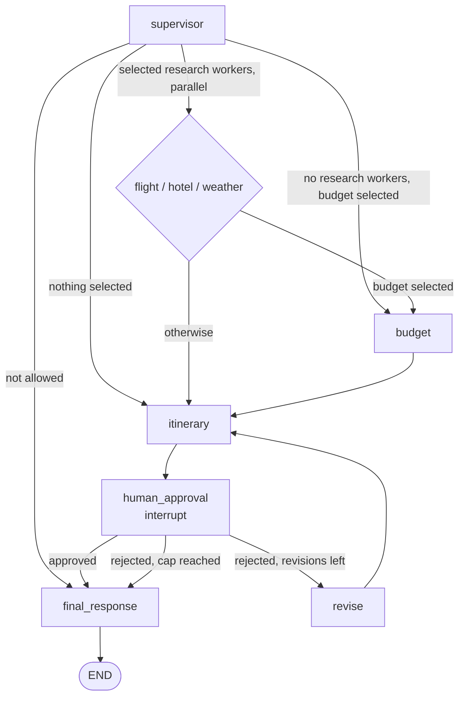

# Agents & LangGraph Specification

**Version:** 2.0
**Status:** Implemented. This spec describes the code in `src/agents/`; the tests in
`tests/unit/test_graph_execution.py`, `test_supervisor.py`, `test_agents.py` and
`tests/integration/test_workflow.py` pin it.
**Dependencies:** config and LLM factory (`01-config`), tools gateway (`03-tools-mcp`),
Postgres saver (`04-memory`)

---

## Overview

One supervisor node checks the request and picks which workers to run. The research workers run
in parallel, the budget and itinerary nodes follow, and the graph then stops at a human approval
node until a person answers. A rejection with feedback loops through a revise node, up to a cap.

There are nine nodes. There is no evaluation node: the eval gate in `src/evals/` is not wired into
the graph (see `07-evals`).

**Principles**

- Routing is deterministic Python (`routing.py`). The LLM only decides what to select.
- The supervisor fails closed: any error means the request is not allowed.
- User text is data. It sits inside tags in prompts and is never treated as instructions.
- Every worker returns a safe fallback value on error, so one failed tool cannot stop the graph.
- A node that calls `interrupt` has no side effect before the call, because it re-runs from its
  first line on resume.

---

## 1. `src/agents/state.py`

`TravelState` is a `total=False` TypedDict, so a node returns only the keys it changes.

| Group | Keys |
|---|---|
| Input | `message`, `thread_id`, `user_id` |
| Supervisor | `allowed`, `reason`, `selected_agents`, `trip_constraints` |
| Worker output | `flight_output`, `hotel_output`, `weather_output`, `budget_output`, `itinerary_output` |
| Approval | `human_approval` (`True`, `False` or `None`), `feedback`, `revision_count` |
| Result | `final_response` |

Unused keys: `total_tokens`, `cost_usd`, `eval_scores`, `eval_passed`, `model_used`,
`created_at`, `updated_at`. Nothing populates them. They are kept so the shape matches the
telemetry and eval specs, and they are safe to remove.

`new_request_state(message, thread_id, user_id)` builds the input for a new request. It resets
every per-request key (outputs, approval, feedback, revision count). This matters because the
Postgres checkpointer keeps the thread's earlier state, and a second message on the same thread
must not inherit the first plan.

## 2. `src/agents/supervisor.py`

One LLM call does three jobs: the guardrail check, the choice of workers, and the extraction of
trip constraints (destination, dates, party size, budget).

- The user message sits inside `<user_request>` tags. Today's date is injected so that relative
  dates ("next Friday") resolve.
- Output is JSON: `allowed`, `reason`, `selected_agents`, `trip_constraints`.
- `allowed` is `True` only if the model returned exactly `True`. Any other value, any parse
  failure and any exception gives `allowed=False`, a generic reason, no agents and no constraints.
- `selected_agents` is filtered to the known names (`flight`, `hotel`, `weather`, `budget`) and
  returned in a fixed order.
- Selection rules in the prompt: flight when there is a destination and dates; hotel when the
  trip is longer than one day; weather when there is a destination and dates; budget when a
  budget is mentioned or the party is larger than one.

## 3. `src/agents/routing.py`

| Function | Returns |
|---|---|
| `route_from_supervisor(state)` | `"final_response"` if not allowed. Otherwise the selected research workers as a list (one parallel superstep). With no research workers: `"budget"` if selected, else `"itinerary"`. |
| `route_from_workers(state)` | `"budget"` if budget is selected, else `"itinerary"`. Every worker returns the same target, so the next node runs once. |
| `route_from_approval(state)` | `"final_response"` if approved. If rejected: `"revise"` while `revision_count < settings.mcp.max_revisions` (default 3), else `"final_response"`. |

Constants: `RESEARCH_AGENTS = ["flight", "hotel", "weather"]` and
`AGENT_ORDER = [*RESEARCH_AGENTS, "budget", "itinerary"]`. The helpers `should_run_agent`,
`get_agent_sequence` and `get_research_agents` describe the order for tests and docs; the graph
itself is wired with the three routing functions above.

## 4. Workers (`src/agents/graph.py`)

All workers read `trip_constraints` through `normalize_trip_constraints` (`trip.py`), which
applies defaults and limits (days, party size, budget, ISO dates).

| Node | Calls | Writes |
|---|---|---|
| `flight_agent` | `search_flights(destination, start_date, party_size, budget)` | `flight_output`: `flights`, `best_option`, `advice`, `source` |
| `hotel_agent` | `search_hotels(destination, budget)` | `hotel_output`: `hotels`, `neighborhoods`, `recommendations`, `status`, optional `error` |
| `weather_agent` | `get_weather(destination, start, end)` | `weather_output`: `current`, `forecast`, `packing_advice`, `status`, `source`, `location` |
| `budget_agent` | nothing (pure arithmetic) | `budget_output`: `categories`, `total`, `feasibility`, `advice` |
| `itinerary_agent` | the LLM, only after feedback | `itinerary_output`: `itinerary`, `highlights`, `notes`, plus `feedback_applied` and `revision_note` on a revision |

The three tool functions come from `src/tools/gateway.py` and use MCP when the servers are up,
with an in-process fallback (`03-tools-mcp`). Flight data is mock data and is labelled
`"source": "mock"`; the frontend shows a "sample fares" notice for it.

**Budget.** Flight cost is `best_option.price * party_size` (prices are per person). The rest of
the budget is split `hotels 0.45`, `food 0.25`, `activities 0.20`, `misc 0.10`. `feasibility` is
false when flights alone exceed the budget. This is a rule of thumb, not a quote.

**Itinerary.** The first draft is built by `_template_itinerary` with no LLM call: one entry per
day from fixed themes, plus the forecast line for each day that has one. After a rejection
(`revision_count > 0` and non-empty feedback), `_apply_feedback` asks the LLM to rewrite the
activity text only. Day numbers and dates stay as the graph computed them. The reply is
validated: exactly the right number of days, 1 to 8 activities per day, each at most 200
characters, note at most 300. If the reply is unusable the previous draft is returned unchanged
and `feedback_applied` is `False`, so the UI never presents an unchanged plan as a revision.
Feedback is wrapped in `<feedback>` tags and treated as data.

## 5. Human approval

- `human_approval_agent` calls
  `interrupt({"kind": "plan_approval", "revision": n, "max_revisions": m, "question": ...})`.
  The checkpointer saves the paused run. The API resumes it with
  `Command(resume={"approved": bool, "feedback": str})`.
- `approved` must be exactly `True`. A resume value that is not a dict counts as "not approved".
- `revise_agent` returns `{"revision_count": n + 1, "human_approval": None}`. The feedback stays
  in state for the itinerary agent.
- `final_response_agent` returns `final_response` with `plan`, `summary`, `share_url` (always
  `None`), `approved` and `revisions`. The summary says the plan was approved, was not planned,
  or hit the revision limit unapproved.

## 6. Runtime (`src/agents/runtime.py`)

`init_graph(saver)` compiles the graph once at startup with the Postgres saver, `get_graph()`
returns it, and `close_graph()` drops it at shutdown. `build_graph(checkpointer)` can also be
called directly, which is what the tests do (with an in-memory saver or none).

## 7. Tests

- `test_supervisor.py`: fail-closed behaviour, tag wrapping, agent filtering.
- `test_graph_execution.py`: every node runs once, budget ordering, fan-out, interrupt and
  resume, the revision cap, unusable LLM replies, independent threads.
- `test_agents.py`: state creation, routing helpers, graph build, a rejected request.
- `tests/integration/test_api.py`: the whole graph through the API against real Postgres,
  including a paused run surviving an application restart.
- `tests/integration/test_workflow.py`: worker output shapes and thread storage against Postgres.

## 8. Known limits

- The first-draft itinerary is generic by design. Only revisions use the LLM.
- Flights are mock data until a real flights provider is added.
- `trace_id` in log lines is empty; request tracing is not wired in.
