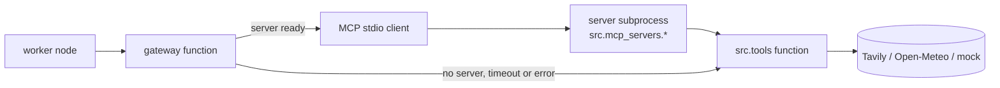

# Tools & MCP Specification

**Version:** 2.0
**Status:** Implemented. This spec describes `src/tools/` and `src/mcp_servers/`; the tests in
`tests/unit/test_tools.py`, `test_gateway.py` and `test_mcp_stdio.py` pin it.
**Dependencies:** config (`01-config`). Used by the workers in `02-agents`.

---

## Overview

The flight, hotel and weather workers do not call providers directly. They call three functions in
`src/tools/gateway.py`. The gateway sends each call to a real MCP server (a child process that
speaks MCP over stdio). If that server is down, disabled or slow, the gateway runs the same tool
in-process instead, so a broken MCP server never breaks a plan.

Every result carries `"via": "mcp"` or `"via": "in-process"`, so a log line or a test can tell
which path answered.

**Principles**

- Tools never raise. They return a dict with `status` of `"success"` or `"error"`.
- Error text that reaches the user is generic. Provider details go to the log only.
- A server subprocess receives only the environment variables it declares. It never sees
  `DATABASE_URL` or the LLM keys.
- MCP is an optimisation of the architecture, not a dependency of the plan: `MCP_ENABLED=false`
  gives the same plans with the in-process tools.

---

## 1. `src/tools/__init__.py` (the tools)

Three async functions. These are the single implementation; the MCP servers wrap them.

| Function | Provider | Notes |
|---|---|---|
| `search_hotels(destination, budget)` | Tavily search API | Needs `TAVILY_API_KEY`. Without it, returns `status: "error"` and makes no network call. Returns up to 5 hotels with `name`, `description`, `url`. |
| `search_flights(destination, departure_date, party_size, budget)` | none (sample data) | Three illustrative options, prices per person and capped by the budget. Labelled `"source": "mock"`. There is no free flight-pricing API. |
| `get_weather(destination, start_date, end_date)` | Open-Meteo (no key) | Geocodes any city. Within about 15 days: a real forecast. Further out: the same dates last year, labelled `"source": "typical_conditions_last_year"`. Output includes `forecast`, `packing_advice`, `location`, `source`. |

Details that tests pin:

- One shared `_http_client()` factory with a 10 second timeout. Tests replace it with a mock
  transport, so no test touches the network.
- Bad or reversed dates return an error before any request is made.
- An unknown city is an error, not a guess.
- A trip that straddles the forecast horizon gets a forecast for the covered days only. A far
  future trip is capped at 16 days.
- WMO weather codes are mapped to words. Packing advice is derived from the numbers (cold, hot,
  rain, snow).

## 2. `src/tools/gateway.py` (MCP with fallback)

### Server list

`ServerSpec(name, module, tool, env_keys=(), required_env=())` is a frozen dataclass.
`SERVERS` holds three entries:

| Name | Module | Tool | Environment | Skipped when |
|---|---|---|---|---|
| hotels | `src.mcp_servers.hotels` | `search_hotels` | `TAVILY_API_KEY` | the key is missing or empty |
| flights | `src.mcp_servers.flights` | `search_flights` | none | never |
| weather | `src.mcp_servers.weather` | `get_weather` | none | never |

A skipped server is not launched. Its calls use the in-process tool directly, which returns the
same "not configured" error the MCP server would have returned.

### `_connection(spec)`

Builds the stdio config: `sys.executable -m <module>`, working directory `PROJECT_ROOT`, and an
environment made of the MCP library's safe default environment plus only the keys in
`spec.env_keys`. This is what keeps secrets out of the child processes.

### `MCPToolbox`

| Member | Behaviour |
|---|---|
| `start(startup_timeout=None)` | Opens one stdio session per runnable server inside an `AsyncExitStack`, loads its tools with `load_mcp_tools`, and checks the expected tool exists. Each server has its own timeout. Never raises. |
| `stop()` | Closes every session and its subprocess. Safe to call when nothing started. |
| `has(tool_name)` | True when a ready server offers that tool. |
| `call(tool_name, args, timeout=None)` | Invokes the tool under `asyncio.timeout` and parses the result back into a dict. |
| `status` | Per server: `"ready"`, `"skipped: X is not set"`, `"failed: <ExceptionName>"` or `"failed: tool X missing (has [...])"`. Exceptions inside task groups are unwrapped so the name is the real cause. |

`_parse_result` accepts a dict, JSON text, or a list of text content blocks, and rejects anything
that is not a JSON object.

One broken server does not affect the others: each is started and timed on its own.

### Module functions

| Function | Behaviour |
|---|---|
| `start_mcp()` | Starts the toolbox. Logs and returns when `settings.mcp.enabled` is false. Never raises. |
| `stop_mcp()` | Stops and discards the toolbox. |
| `mcp_status()` | The toolbox status, or `{"mode": "in-process"}` when there is no toolbox. Shown by `GET /ready`. |
| `search_hotels`, `search_flights`, `get_weather` | Same signatures as the in-process tools. Each calls `_call`. |

`_call(tool_name, args, fallback)` tries MCP when the toolbox has the tool. On any exception or
timeout it logs a warning and runs the fallback. The returned dict is tagged with `via`.

### Settings

| Variable | Default | Meaning |
|---|---|---|
| `MCP_ENABLED` | `true` | `false` skips every server and uses the in-process tools. |
| `MCP_STARTUP_TIMEOUT` | `20` seconds | Per server, at startup. |
| `MCP_CALL_TIMEOUT` | `25` seconds | Per tool call. |

MCP state is informational: `/ready` reports it but does not fail when a server is down, because
the fallback still serves every request.

## 3. `src/mcp_servers/`

Three small FastMCP servers, one tool each, started as `python -m src.mcp_servers.<name>` over
stdio. Each tool wrapper calls the matching function in `src/tools`. They set
`log_level="WARNING"` because stdout belongs to the protocol.

Rule: these modules must never import `src.core.config`. That module reads the database URL and
the LLM keys, and a subprocess has no business loading them. They read only the environment
variables the gateway hands over.

## 4. `.mcp.json`

Declares the same three servers for MCP clients such as Claude Code, so a developer can call the
tools by hand: `yatra-hotels` (with `TAVILY_API_KEY`), `yatra-flights` and `yatra-weather`. The
application does not read this file; it uses `SERVERS` in the gateway.

## 5. Cost and limits

- Each measured server process used about 58 to 64 MB. Three servers add roughly 180 MB, and the
  estimate for the whole container on Render's 512 MB free tier is about 290 MB. This is an
  estimate from local measurements on Windows, not a figure measured on Render.
- If the free tier runs out of memory, set `MCP_ENABLED=false`. Plans are the same; only the
  `via` tag changes.
- Without `TAVILY_API_KEY` the hotels server is not started, which also saves memory, and the plan
  shows "Hotel search is not configured."
- Flights are sample data until a real provider is added.

## 6. Tests

- `test_tools.py`: Tavily request and mapping, provider errors without leaked details, no network
  call without a key, flight labelling and budget cap, weather geocoding, horizon handling, bad
  dates, packing advice. All with a mock HTTP transport.
- `test_gateway.py`: result parsing, the subprocess environment (secrets hidden, only declared
  keys forwarded), the Tavily skip rule, every server module exists, MCP answer versus fallback,
  a failing or missing tool, one broken server, argument pass-through, status reporting,
  start and stop, timeouts. Uses a fake toolbox.
- `test_mcp_stdio.py`: real subprocesses. A real server answers over stdio, the wrapper reports
  `via: "mcp"`, a server that cannot start is skipped, and a dead server falls back.
