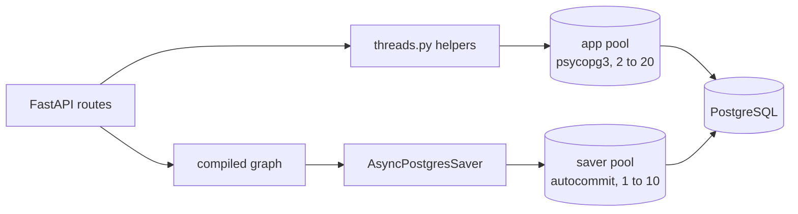

# Memory & PostgreSQL Specification

**Version:** 2.0
**Status:** Implemented. This spec describes `src/memory/`; the tests in
`tests/unit/test_memory.py`, `test_threads_helpers.py`, `test_startup.py` and
`tests/integration/test_api.py` pin it.
**Dependencies:** config (`01-config`). Used by the API (`05-api`) and the graph runtime
(`02-agents`).

---

## Overview

PostgreSQL holds two kinds of data, kept apart on purpose.

| Data | Owner | Tables |
|---|---|---|
| Thread list and message history, including the stored plan document and approval decisions | this repository (`src/memory/threads.py`) | `threads`, `messages` |
| The paused and finished state of every graph run | LangGraph's `AsyncPostgresSaver` | `checkpoints`, `checkpoint_blobs`, `checkpoint_writes`, `checkpoint_migrations` |

The saver is what makes human approval real. The graph stops at `interrupt()`, the saver stores
the state, and a later request resumes it. A paused run survives an application restart, and it
does not matter which worker answers the resume request.



---

## 1. Two connection pools

| Pool | Module | Size | Settings |
|---|---|---|---|
| App pool `db_pool` | `src/memory/db.py` | 2 to 20 | psycopg defaults: explicit commits |
| Saver pool inside `checkpoint_store` | `src/memory/saver.py` | 1 to 10 | `autocommit=True`, `prepare_threshold=0`, `dict_row` |

The saver requires autocommit, no prepared statements and dict rows. The repository's own helpers
use tuple rows and explicit commits. The two needs conflict, so each side gets its own pool.

`DatabasePool` offers `init(timeout)`, `close()`, `acquire(timeout)`, `execute`, `execute_one`
and `execute_insert` (which commits). `init` opens the pool with `wait=True`, so a bad
`DATABASE_URL` fails at startup and not on the first request.

`CheckpointStore` offers `init(database_url, timeout)`, `close()` (safe to call twice) and the
`saver` property, which raises if `init` has not run. `init` opens the pool, builds the saver and
calls `saver.setup()`, which creates the saver's own tables. If anything fails, the pool is
closed before the error is raised.

## 2. Startup and shutdown order

Defined in `src/core/startup.py`:

1. Require `settings.database.url`.
2. Connect the app pool. Up to 10 attempts, 2 seconds apart, so the app can start while the
   database is still waking up.
3. `run_migrations()`.
4. `checkpoint_store.init(url)`. This must run after the migrations (see section 3).
5. `init_graph(saver)`.
6. `start_mcp()`. It never raises (`03-tools-mcp`).

Shutdown reverses it: `stop_mcp`, `close_graph`, `checkpoint_store.close`, `db_pool.close`.

## 3. Migrations

`run_migrations()` in `src/memory/migrations.py` executes every `.sql` file in
`src/memory/migrations/`, in name order, on every boot and with a commit after each file. Every file is
idempotent, so there is no migration table and no separate deploy step.

**`001_init.sql`**

```sql
CREATE TABLE IF NOT EXISTS threads (
    thread_id  UUID PRIMARY KEY,
    user_id    VARCHAR(255) NOT NULL,
    created_at TIMESTAMP DEFAULT CURRENT_TIMESTAMP,
    updated_at TIMESTAMP DEFAULT CURRENT_TIMESTAMP,
    metadata   JSONB DEFAULT '{}'
);
CREATE INDEX IF NOT EXISTS idx_user_id    ON threads(user_id);
CREATE INDEX IF NOT EXISTS idx_created_at ON threads(created_at);

CREATE TABLE IF NOT EXISTS messages (
    message_id UUID PRIMARY KEY,
    thread_id  UUID NOT NULL REFERENCES threads(thread_id) ON DELETE CASCADE,
    role       VARCHAR(20) NOT NULL,
    content    TEXT NOT NULL,
    metadata   JSONB DEFAULT '{}',
    created_at TIMESTAMP DEFAULT CURRENT_TIMESTAMP
);
CREATE INDEX IF NOT EXISTS idx_thread_id_created_at ON messages(thread_id, created_at);
```

**`002_langgraph_checkpoints.sql`.** An earlier version of migration 001 created a custom
`checkpoints` table that no code used. LangGraph's saver creates a table with the same name and a
different shape, so the old one has to go first. The migration drops `checkpoints` only if it has
the legacy `step` column, so the saver's own table is never touched, and it drops the unused
`checkpointer_config` table. On a fresh database it does nothing.

## 4. Thread helpers (`src/memory/threads.py`)

All helpers use the app pool. Any id that is not a valid UUID is answered with an empty result
before the database is asked, because Postgres raises on a malformed value in a UUID column.

| Function | Behaviour |
|---|---|
| `create_thread(user_id, metadata=None)` | Inserts a thread with a new UUID and returns it. |
| `get_thread(thread_id)` | Returns `thread_id`, `user_id`, `created_at`, `updated_at`, `metadata`, or `None`. |
| `add_message(thread_id, role, content, metadata=None)` | Inserts a message and bumps the thread's `updated_at`. |
| `get_history(thread_id, limit=50)` | Messages in chronological order. |
| `get_latest_plan(thread_id)` | The newest message whose `metadata.kind` is `plan`, returning its `metadata.plan` document. |
| `get_latest_approval(thread_id)` | The newest `human_approval` message as `{approved, feedback}`. Whether it still applies is the caller's call: the plan document records it (`plan.approval.approved` stays `None` until the plan is decided). |
| `delete_thread(thread_id)` | Deletes the thread row; its messages follow through the cascade. |

`delete_thread` is covered by a unit test but no route calls it. It also does not remove the
thread's rows in the saver's tables. If a delete endpoint is added, it must clear those too.

JSONB comes back from psycopg as a dict. `_as_dict` also accepts a JSON string, so older drivers
and test fakes behave the same.

### Message roles in use

| Role | Written by | Content |
|---|---|---|
| `user` | the plan route | the traveller's request |
| `assistant` | the plan stream | the plan summary; `metadata` holds `kind: "plan"` and the full plan document |
| `human_approval` | the approve route | the decision; `metadata` holds `approved` and `feedback` |

The plan is stored before the `plan` event is sent, so a client that disconnects does not lose it.

## 5. What is not stored

- Users. `user_id` is a plain string with no login and no profile table. A thread's id is the only
  secret, and the API treats it as unguessable. This is a known limit (see `DEPLOYMENT.md`).
- Long-term, cross-thread memory. Each thread is independent. The checkpointer keeps one thread's
  state, and `new_request_state` resets the per-request keys so a second message on a thread does
  not inherit the first plan.

## 6. Tests

- `test_memory.py`: create, get, history order and limit, metadata, update time and delete, run
  against an in-memory fake of the pool (`tests/unit/conftest.py`).
- `test_threads_helpers.py`: UUID validation, JSONB normalisation, malformed ids never reach the
  database, a round trip through the fake.
- `test_startup.py`: the startup and shutdown order listed in section 2.
- `tests/integration/test_api.py`, against real PostgreSQL: the paused run is stored in the
  checkpointer, a paused trip survives an application restart, the plan document and the approval
  are served back by the thread endpoint, a decision does not carry over to a new request.
- `tests/integration/conftest.py` opens the real pool and runs the real migrations. Nothing is
  mocked, so these tests need a running PostgreSQL and `DATABASE_URL`. Without a database they
  fail; they are not skipped.
