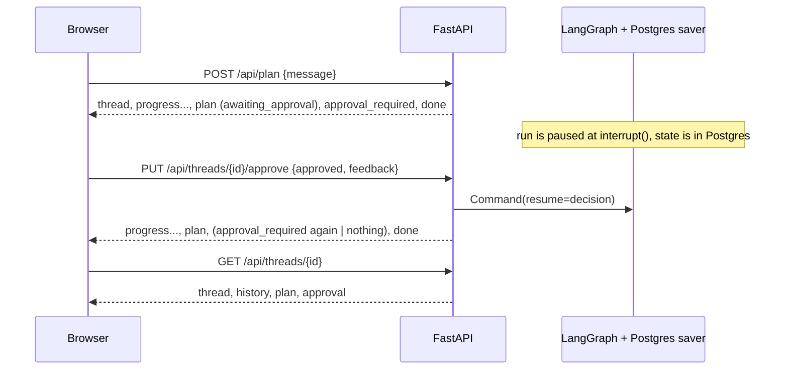

# API Specification

**Version:** 2.0
**Status:** Implemented. This spec describes `src/api/` (`main.py`, `streaming.py`,
`routes/planning.py`, `routes/approval.py`, `routes/health.py`). The tests in
`tests/unit/test_routes.py`, `test_cors.py`, `test_readiness.py`, `test_plan.py`,
`test_graph_execution.py` and `tests/integration/test_api.py` pin it.
**Dependencies:** config (`01-config`), graph runtime (`02-agents`), memory (`04-memory`),
gateway status (`03-tools-mcp`).

---

## Overview

A FastAPI application with three jobs: start a plan and stream its progress, resume a plan that is
waiting for a human decision, and serve a stored thread back to the browser. Progress is sent as
Server-Sent Events (SSE) over a normal HTTP response, so the browser needs no WebSocket.



**Principles**

- One shared runner (`graph_events`) serves both streaming routes, so they cannot drift apart.
- The plan is stored before it is announced. A client that sees a `plan` event can always reload
  it from the thread.
- Errors that reach the client are generic. The real error goes to the log.
- The pause is a checkpoint, not an open connection. The person may answer minutes later, from
  another tab, or after the application restarted.

---

## 1. `src/api/main.py`

`create_app()` returns the application: title "Yatra AI", description "Multi-agent travel planner
with LangGraph", version "1.0.0".

- **Lifespan.** On start it runs `init_app()` (database, migrations, saver, graph and MCP, in the
  order given in `04-memory`). On stop it runs `close_app()`.
- **Routers.** `health`, `planning` and `approval`.
- **CORS.** `allow_origins` comes from `CORS_ORIGINS`, `allow_origin_regex` from
  `CORS_ORIGIN_REGEX` (`01-config`). `allow_credentials` is `False`, the allowed methods are
  `GET`, `POST`, `PUT` and `OPTIONS`, and the only allowed request header is `Content-Type`. An
  origin that is not in the list gets no CORS headers. The app uses no cookies, so credentials
  stay off, which also keeps a wildcard from ever being safe to add by mistake.
- **Static files.** If they exist, `frontend/.next/static` is served at `/_next/static` and
  `frontend/public` at `/public`. The Render deployment runs the frontend as its own service, so
  these mounts mostly matter for a single-container run.
- **Error handler.** Any exception that no route handled becomes HTTP 500 with the body
  `{"error": "Internal server error"}`.

## 2. Routes

| Method and path | Purpose | Success response |
|---|---|---|
| `POST /api/plan` | Start a plan | SSE stream |
| `PUT /api/threads/{thread_id}/approve` | Answer a paused plan | SSE stream |
| `GET /api/threads/{thread_id}` | Read a thread | JSON |
| `GET /health` | Liveness | JSON |
| `GET /ready` | Readiness | JSON |

### `POST /api/plan`

Body (`PlanRequest`):

| Field | Type | Rules |
|---|---|---|
| `message` | string | required, 1 to 4000 characters |
| `user_id` | string | default `"anonymous"` |
| `thread_id` | string or null | continue an existing thread |

Flow:

1. A given `thread_id` must exist, else HTTP 404 `Thread not found`. Without one, a new thread is
   created.
2. The user message is stored (`role: "user"`).
3. `new_request_state(...)` builds the graph input. It resets the per-request keys, so a second
   message on the same thread starts a fresh request, even if the first one was still waiting for
   approval.
4. The response is `text/event-stream` with `Cache-Control: no-cache` and
   `X-Accel-Buffering: no` (so a proxy does not buffer the stream).

Any failure before the stream starts gives HTTP 500 `Could not start trip planning.` An invalid
body is answered by FastAPI itself with HTTP 422.

### `PUT /api/threads/{thread_id}/approve`

Body (`ApprovalRequest`): `approved` (boolean, required) and `feedback` (string, optional).

The checks run in this order, and the first one that fails answers:

| Check | Status | Detail |
|---|---|---|
| Unknown thread (or an id that is not a UUID) | 404 | `Thread not found` |
| Rejection with blank feedback | 400 | `Tell us what to change when you reject the plan.` |
| A run is in flight, or the thread has no pending interrupt | 409 | `This trip has no plan waiting for approval.` |
| Storing the decision fails | 500 | `Could not record the approval.` |
| Body missing a boolean `approved` | 422 | FastAPI validation error |

A rejection without a reason is refused because it could only regenerate the same draft. Because
the checks come before anything is written, a refused request leaves the pause in place.

When all checks pass, the decision is stored as a `human_approval` message (`metadata.kind` is
`approval`, with `approved` and `feedback`), and the graph is resumed with
`Command(resume={"approved": ..., "feedback": ...})`. The response is the same kind of SSE stream
as `POST /api/plan`.

A pause is detected with `graph.aget_state(config).interrupts`. A second answer to the same pause
is a 409, because the first answer already moved the thread on.

### `GET /api/threads/{thread_id}`

Returns:

```json
{
  "thread": {"thread_id": "...", "user_id": "...", "created_at": "...", "updated_at": "...", "metadata": {}},
  "history": [{"message_id": "...", "role": "user", "content": "...", "metadata": {}, "created_at": "..."}],
  "message_count": 3,
  "plan": {"status": "awaiting_approval", "...": "..."},
  "approval": null
}
```

`plan` is the newest stored plan document. `approval` is the newest stored decision, but only when
`plan.approval.approved` is not `null`, that is, when the plan has been decided. While a draft is
still waiting, `approval` is `null`, so an old answer is never shown against a new draft.

Errors: 404 `Thread not found` (also for an id that is not a UUID), and 500
`Could not load the thread.`

## 3. The event stream

Every frame is one line, `data: {json}`, followed by a blank line. Each JSON object has a `type`.

| `type` | Other fields | Sent |
|---|---|---|
| `thread` | `thread_id` | First, so the client knows the thread id. |
| `progress` | `node` | Once for each graph node that finishes. The LangGraph `__interrupt__` key is not a node and is skipped. |
| `plan` | `plan` | After the run stops, whether it finished or paused. The full plan document (section 5). |
| `approval_required` | `request` | Only when the run paused. `request` is the interrupt value: `kind`, `revision`, `max_revisions`, `question`. |
| `done` | none | Last frame of a run that ended normally. |
| `error` | `error` | Last frame of a run that failed. The text is always generic. |

A run ends one of two ways:

- **Finished:** `thread`, `progress`..., `plan`, `done`.
- **Paused:** `thread`, `progress`..., `plan` (status `awaiting_approval`), `approval_required`,
  `done`. The stream ends here. The person answers later with the approve route.

An example of the first request for a trip, abbreviated:

```text
data: {"type": "thread", "thread_id": "3f2b6d5e-..."}

data: {"type": "progress", "node": "supervisor"}

data: {"type": "progress", "node": "flight"}

data: {"type": "progress", "node": "hotel"}

data: {"type": "progress", "node": "weather"}

data: {"type": "progress", "node": "budget"}

data: {"type": "progress", "node": "itinerary"}

data: {"type": "plan", "plan": {"status": "awaiting_approval", "...": "..."}}

data: {"type": "approval_required", "request": {"kind": "plan_approval", "revision": 0, "max_revisions": 3, "question": "..."}}

data: {"type": "done"}
```

The order of the three research `progress` frames is not fixed, because those nodes run in
parallel. The paused run has no `human_approval` frame, because that node has not finished: it
stopped inside `interrupt()`. A resumed run starts with it:

| Decision | `progress` frames of the resumed run | Then |
|---|---|---|
| Approved | `human_approval`, `final_response` | `plan` (status `approved`), `done` |
| Rejected, revisions left | `human_approval`, `revise`, `itinerary` | `plan` (`awaiting_approval`, `revision` raised by one), `approval_required`, `done` |

### Errors inside a stream

Once the response has started, the status code is already 200, so a failure is reported as a frame:

| Situation | Frame |
|---|---|
| The graph, the tools or the database raises | One `error` frame: `We could not plan this trip right now. Please try again.` No plan is stored. |
| A run on the same thread is already in flight | One `error` frame: `This trip is already being worked on. Please wait for it to finish.` Nothing runs. |

### Busy threads and disconnects

- `_running` is a module-level set of thread ids with a run in flight in this process. It stops two
  runs from resuming the same checkpoint. The claim is released in a `finally` block, so a crash
  does not lock a thread. It is per process, which is correct for the single-instance deployment.
  With several workers or instances it would not be enough (section 7).
- If the client disconnects, the run is cancelled. The checkpointer keeps the state of the last
  finished step, and no plan is stored for the interrupted run. The same thread can start again.

## 4. Health and readiness (`routes/health.py`)

**`GET /health`** is liveness. It never touches the database.

```json
{"status": "ok", "service": "Yatra AI",
 "features": ["supervisor_agent", "input_guardrail", "human_in_the_loop",
              "postgres_checkpointer", "mcp_tools"]}
```

**`GET /ready`** is readiness. Render's `healthCheckPath` points here.

| Situation | Status | Body |
|---|---|---|
| The database pool does not exist | 503 | `{"status": "not_ready", "error": "Database pool not initialized"}` |
| `SELECT 1` fails or takes longer than 3 seconds | 503 | `{"status": "not_ready", "error": "Database unavailable"}` |
| Otherwise | 200 | `{"status": "ready", "mcp": {...}}` |

The real database error is logged and never returned. `mcp` is the gateway status per server
(`ready`, `skipped: ...` or `failed: ...`, see `03-tools-mcp`). It is informational: a broken MCP
server does not make the application unready, because the in-process fallback still serves every
request.

## 5. The plan document (`src/agents/plan.py`)

`build_plan(state, awaiting_approval, max_revisions)` turns the final checkpoint state into one
self-contained document. The stream stores it with the thread and sends it in the `plan` frame, and
the thread route returns the stored copy. The frontend renders only this document.

| Field | Content |
|---|---|
| `status` | `rejected`, `awaiting_approval`, `approved` or `revision_limit` |
| `reason` | The supervisor's reason (used when the request is refused) |
| `summary` | A fixed draft sentence while awaiting approval, else the final response summary |
| `trip` | The normalised constraints: destination, dates, party size, budget |
| `flights`, `hotels`, `weather`, `budget`, `itinerary` | The worker outputs, or `null` |
| `approval` | `approved` (`null` while a decision is open), `revision`, `max_revisions`, `feedback_applied`, `revision_note` |

Statuses:

| Status | Meaning |
|---|---|
| `rejected` | The supervisor did not accept the request (not travel, unsafe, unclear). Everything except `status` and `reason` is `null`. |
| `awaiting_approval` | A draft is ready and the graph is paused for a decision. |
| `approved` | A person approved the plan. |
| `revision_limit` | The person kept rejecting. This is the latest draft and it is not approved. |

`feedback_applied` is `false` when the LLM reply for a revision was unusable and the previous draft
was kept (`02-agents`), so the UI can say so and not present an unchanged plan as a revision.

## 6. Security

- **No login.** A thread id (a random UUID) is the only secret. Anyone who has the id can read the
  thread and answer its approval. This is a stated limit of the project (`DEPLOYMENT.md`).
- **Input size.** The message is limited to 4000 characters. The guardrail in the supervisor is
  described in `02-agents`.
- **CORS** is an allow-list with credentials off (section 1).
- **No detail leaks.** Client-visible errors are generic strings. Stack traces and provider
  messages go to the log only.
- **No rate limiting.** Each plan costs one or more LLM calls, so a public deployment should add
  one at the edge.

## 7. Known limits

- The `_running` guard is per process. A deployment with more than one instance would need a
  database-level claim.
- Disconnecting mid-run loses that run's draft (the state of the finished steps stays in the
  checkpointer, but no plan document is stored).
- Nothing deletes a thread through the API (`04-memory`).
- SSE on Render's free tier has not been verified. The `X-Accel-Buffering: no` header and the
  `no-cache` header are set so a proxy should not buffer, but this is not proven there.

## 8. Tests

- `test_routes.py` (the real graph with an in-memory saver, a fake database pool, and a faked
  supervisor, LLM and network tools; see `tests/unit/conftest.py`): health, readiness, request
  validation, 404 for unknown and non-UUID thread ids, the full stream for a trip, the progress
  frames, the draft plan with an open decision, the approval request carrying the revision budget,
  a refused request ending as a rejected plan without a pause, a busy thread, a crash reported
  without its details, every approve check (400, 404, 409, 422), approval finishing the run, the
  decision stored with the thread, a rejection revising and asking again, the revision cap
  ending with an unapproved plan, and CORS for the approve route.
- `test_cors.py`: defaults, list parsing, an allowed origin, a refused origin, credentials never
  allowed, the allowed methods, a matching preview origin, a look-alike origin refused.
- `test_readiness.py`: the 503 shape, the 200 path, and a probe failure that does not leak the
  error.
- `test_plan.py` and `test_graph_execution.py`: the plan document and the graph behind the stream.
- `tests/integration/test_api.py`, against real PostgreSQL and the real saver: every agent runs
  once, the paused run is stored in the checkpointer, a paused trip survives an application
  restart, a new message on a paused thread starts a fresh request, approval resumes and
  finishes, a rejection revises, the revised draft can be approved, the cap ends the loop, a
  decision does not carry over to a new request, and a failing run streams a generic error and
  stores no plan.
