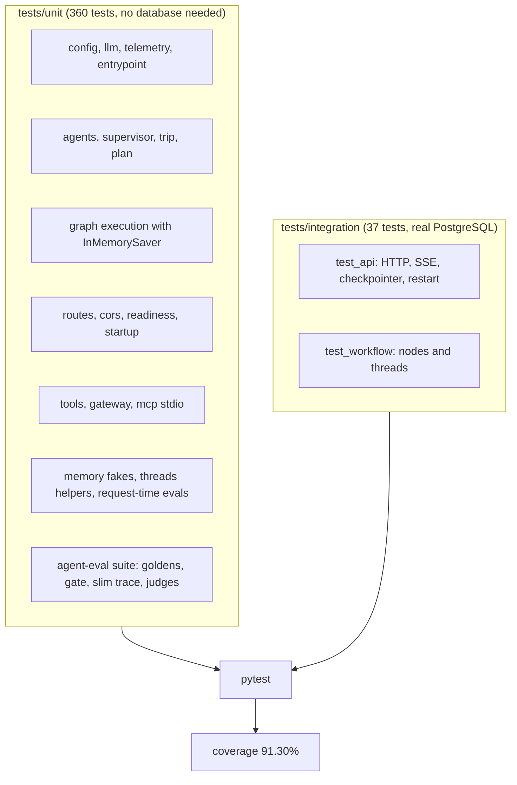

# Tests Specification

**Version:** 3.0
**Status:** Implemented. This spec describes the test suite in `tests/` as it is today. The first
version (2026-09-29) was a plan with code sketches; some of those sketches described files that
were never written and one asserted nothing. They are gone. Version 3.0 adds the fallback-chain
tests and the 74 tests of the DeepEval agent-eval suite (`tests/unit/test_eval_suite.py`).
**Dependencies:** every other spec. Each of them has a "Tests" section that says what pins it.

---

## Overview

The last full run, with a real PostgreSQL available, gave:

| Result | Value |
|---|---|
| Tests | 397 passed: 360 unit and 37 integration (parametrised cases count separately) |
| Line coverage | 91.30% of `src` (1467 statements, 113 missed, branch coverage on) |
| Time | about 217 seconds for the full run |
| Where | A Windows 10 machine, Python 3.11, a throwaway local PostgreSQL 17 on port 55432, with `requirements-eval.txt` installed |

That run was local. On GitHub Actions the suite passed on commit 808083d (PostgreSQL 15, a fresh
install, `08-gate-ci`); the changes made after that commit have not run there yet. Without DeepEval
installed, the 74 tests of
`test_eval_suite.py` skip themselves and the rest run as before.

No test calls a real LLM, and none calls a paid or rate-limited API. The network tools are faked
with a mock HTTP transport. The one place a test starts child processes is `test_mcp_stdio.py`, and
those run the repository's own MCP servers.



---

## 1. Layout

```
tests/
  conftest.py              shared fixtures and environment defaults
  unit/
    conftest.py            mock_db_pool, graph_runtime, client
    test_config.py         settings, model allow-list, DATABASE_URL rules
    test_entrypoint.py     .env loading in main.py
    test_envutil.py        API-key whitespace cleaning (strip_api_keys, LLMConfig)
    test_llm_factory.py    model construction, wire names, caching, the fallback chain
    test_telemetry.py      JSON logs and trace id
    test_supervisor.py     routing, guardrail, constraint extraction
    test_trip.py           normalising supervisor output into trip data
    test_agents.py         TravelState, agent selection, graph builds
    test_graph_execution.py the real graph: routing, interrupt, resume, revisions
    test_plan.py           the plan document and its statuses
    test_routes.py         API routes and the SSE stream
    test_cors.py           CORS rules
    test_readiness.py      /ready and its 503 shapes
    test_startup.py        startup and shutdown order
    test_memory.py         thread and message helpers on a fake pool
    test_threads_helpers.py UUID checks and JSONB normalising
    test_tools.py          Tavily, flights, Open-Meteo (mock HTTP)
    test_gateway.py        MCP gateway with a fake toolbox
    test_mcp_stdio.py      real MCP subprocesses over stdio
    test_evals.py          request-time eval judges and gate logic (fake judge model)
    test_eval_suite.py     DeepEval agent-eval suite: goldens, scripts, gate exit codes (no network)
  integration/
    conftest.py            real pool, real migrations, API client
    test_api.py            API against PostgreSQL
    test_workflow.py       agent outputs and thread flows against PostgreSQL
```

## 2. Shared setup

`tests/conftest.py` runs before every import of the application:

- On Windows it selects `WindowsSelectorEventLoopPolicy`, because psycopg's async pool does not
  run on the default Proactor loop.
- `os.environ.setdefault` gives `OPENAI_API_KEY`, `DEEPSEEK_API_KEY` and `DATABASE_URL` test
  values, so `settings` loads without a real `.env`. A `DATABASE_URL` that is already set (CI, or
  a local test database) is kept.
- `MCP_ENABLED=false`, so tests that go through the gateway use the in-process tools. Only
  `test_mcp_stdio.py` starts real servers, and it does so explicitly.
- An autouse fixture, `reset_env`, restores the environment after each test.
- Small fixtures (`mock_llm`, `mock_database_url`, `sample_travel_request`, `sample_thread_id`)
  for tests that want them.

`tests/unit/conftest.py` adds the three fixtures most unit tests use:

| Fixture | What it does |
|---|---|
| `mock_db_pool` | Patches the methods of the app `DatabasePool` with an in-memory fake, so thread helpers and routes need no database. |
| `graph_runtime` | Calls `init_graph(InMemorySaver())`, so the real graph can pause and resume in memory. |
| `client` | A FastAPI `TestClient` on `create_app()` with the two above. |

`tests/integration/conftest.py` opens the real pool, runs the real migrations and builds a client
that runs the application lifespan. Nothing in it is mocked.

## 3. What is real and what is faked

| Part | Unit tests | Integration tests |
|---|---|---|
| LangGraph graph, routing, `interrupt()` and `Command(resume=...)` | real | real |
| Checkpointer | `InMemorySaver` | real `AsyncPostgresSaver` |
| App database | in-memory fake of the pool | real PostgreSQL |
| Supervisor LLM call | faked | faked (`fake_trip` fixture) |
| Itinerary revision LLM | fake chat model | fake chat model |
| Tavily, Open-Meteo, flights | mock HTTP transport or patched tools | patched tools |
| MCP servers | fake toolbox; `test_mcp_stdio.py` uses real subprocesses | not started |
| FastAPI app, SSE stream, status codes | real | real |

The consequence is plain: the application logic, the HTTP layer and the persistence are exercised
for real, and the model's answer is always scripted. **No test shows that DeepSeek returns a
sensible plan.** The wording of replies from a real model is covered by tests that feed the code
awkward replies on purpose (fenced JSON, non-boolean flags, junk), not by a live call.

## 4. Behaviour the suite pins down

- **Supervisor** (`test_supervisor.py`): the guardrail fails closed on junk or a model error, with
  no exception text leaked; `allowed` must be a real boolean; unknown agent names are dropped; the
  user text is passed as data with today's date; weather is chosen by destination and dates.
- **Graph** (`test_graph_execution.py`): every node runs once; budget runs after research;
  budget uses the real flight cost; rejected requests skip every worker; the run pauses at approval
  without a final response; approval resumes it; a rejection revises and pauses again; the revision
  cap ends the loop with an unapproved plan; `MAX_REVISIONS=0` ends on the first rejection;
  `approved` must be exactly `True`; threads pause and resume independently; a new message on a
  paused thread starts a clean request; an unusable LLM reply or an outage keeps the previous
  draft.
- **Plan document** (`test_plan.py`): statuses, draft versus approved, the revision cap, whether
  feedback was applied, sections that never ran are `None`.
- **Routes** (`test_routes.py`): the SSE frames and their order, 404, 400, 409, 422 and 500 paths,
  a rejection without feedback, a second run on the same thread while one is in flight, and
  generic error texts.
- **Tools and gateway** (`test_tools.py`, `test_gateway.py`, `test_mcp_stdio.py`): result mapping,
  no leaked provider details, no network call without a key, secrets kept out of child
  processes, MCP answer versus fallback, a broken server not affecting the others, timeouts.
- **Memory** (`test_memory.py`, `test_threads_helpers.py`, `test_startup.py` and
  `integration/test_api.py`): see `04-memory`. The integration file includes a paused trip that
  survives an application restart.
- **Config and entrypoint** (`test_config.py`, `test_entrypoint.py`): see `01-config`.

## 5. Running the tests

The eval suite's tests need DeepEval, which is not in `requirements.txt` on purpose (Render does not
need it). Install the full set for a complete run:

```bash
pip install -r requirements-eval.txt
```

Without DeepEval, `tests/unit/test_eval_suite.py` skips itself (`pytest.importorskip`) and the rest
of the suite runs as before.

Unit tests need no database:

```bash
pytest tests/unit -q
```

Integration tests need PostgreSQL 15 or newer and a `DATABASE_URL` that points at an empty test
database. They fail, they do not skip, when there is none:

```bash
export DATABASE_URL=postgresql://postgres@localhost:5432/yatra_test
pytest tests -q --cov=src --cov-report=term
```

On PowerShell, set the variable with `$env:DATABASE_URL = "..."`.

Quality checks that the CI lint job runs besides the tests (`.github/workflows/ci.yml`):

```bash
ruff check src tests evals .github/scripts
black --check src tests evals .github/scripts
pyright src
```

Locally it is worth adding `main.py` to the black and pyright runs, because the entrypoint is not
covered by the CI commands above.

## 6. Configuration notes

- `pytest.ini` is the file pytest reads. It sets `testpaths`, `asyncio_mode = auto`,
  `--strict-markers -ra` and registers the markers `unit`, `integration`, `slow` and `asyncio`.
  The `[tool.pytest.ini_options]` table in `pyproject.toml` is shadowed by it, so its coverage
  options do not apply on their own. Pass `--cov=src` explicitly, as CI does.
- No test is marked `unit`, `integration` or `slow` today, so `-m unit` selects nothing. Run a
  folder instead.
- `pyproject.toml` configures coverage (`source = ["src"]`, branch coverage, usual exclusions).
  There is no `fail_under` setting, so no minimum is enforced; the 91.30% above is a measurement,
  not a gate.

## 7. Coverage notes

The files below 90% in the last run (91.30% overall), and what the missed lines are (checked
against the source):

| File | Coverage | Missed code |
|---|---|---|
| `src/evals/judges/_common.py` | 59.38% | Reading a reply whose content is a list of blocks, and the "reply is not a JSON object" error. |
| `src/evals/gate.py` | 74.60% | The factuality-below-threshold branch, the budget-below-threshold branch, and the `except` handler that turns an error into a failure. |
| `src/memory/saver.py` | 82.35% | The `saver` property error before `init`, the cleanup when `init` fails, and `close` before `init`. |
| `src/core/telemetry.py` | 82.69% | The bodies of `TraceContext.set` and `reset`, one branch, and `log_with_context`. |
| `src/evals/judges/factuality.py` | 85.00% | The handler for a judge call that raises. |
| `src/agents/runtime.py` | 86.67% | The `get_graph` error when the graph was never initialised. |
| `src/memory/db.py` | 86.67% | The cleanup when the pool fails to open, and `acquire` before `init`. |
| `src/api/routes/planning.py` | 88.46% | The generic `except Exception` handlers of two routes. |
| `src/agents/jsonutil.py` | 88.89% | A fenced reply that has no `json` tag. |
| `src/agents/graph.py` | 89.29% | Among others, the `except` handlers of the flight and hotel nodes and the hotel error branch. |
| `src/api/main.py` | 89.47% | The frontend static mounts and the global exception handler. |
| `src/mcp_servers/*` | 0% | They run in a child process, which the coverage tool does not follow. `test_mcp_stdio.py` does exercise them. |

The new `evals/` package (the DeepEval agent evals) is outside `--cov=src`, so its coverage is not
measured. Its behaviour is checked by `test_eval_suite.py` (section 3).

## 8. Known gaps

- No test calls a real model, so a change in DeepSeek's behaviour would not be caught here.
- The fallback chain (`01-config`, section 3) is tested with fake clients only. No call to a real
  DeepSeek or OpenAI endpoint has been made, so the order of fallbacks, the timeouts and the
  `deepseek-flash` model name are checked against the provider's documentation and not against a
  live reply.
- The DeepEval agent-eval suite is tested without a model (a stub judge and the real graph, plus
  unit tests of every helper and of the gate). **One live run exists** (3 Oct 2026, `07-evals`,
  section 8.7): it failed the original gate and the gate was revised after it. These tests do not call a model.
- The coverage figure comes from a local run (Windows, PostgreSQL 17). CI uses PostgreSQL 15 and passed on
  commit 808083d, before the key-cleaning and date changes (`08-gate-ci`).
- The frontend has no automated tests. It is only checked by `next build`, which includes the
  TypeScript type check, in the `verify.yml` workflow. That workflow deletes the lockfile before
  it installs (`10-frontend`). `ci.yml` has no frontend step.
- The Docker image build is a CI step, not a test, and it has not been run on the author's machine.
- Nothing measures latency or load.
