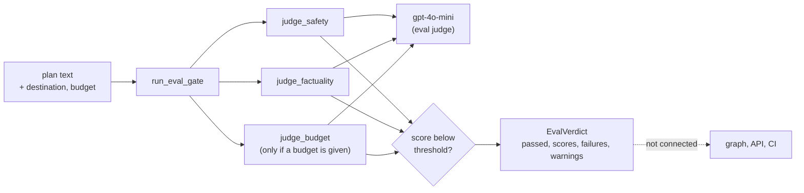
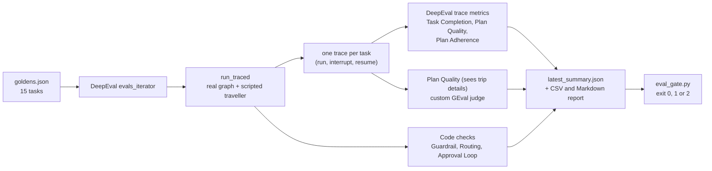

# LLM-Judged Evals Specification

**Version:** 3.0
**Status:** Two separate eval systems exist.

1. **Request-time judges** (`src/evals/`, sections 1 to 7). Three plain LLM prompts and a
   threshold gate. They work and are unit tested with a fake judge model. Nothing in the running
   application calls them.
2. **Agent evals with DeepEval** (`evals/` at the repository root, section 8). They run the real
   LangGraph agent against a golden dataset and score each run. They follow the structure of the
   `campusx-official/agent-evals-deepeval` reference repository. A merge gate
   (`.github/scripts/eval_gate.py`) and a CI job (`agent-evals`) are wired to them. **No live
   score from a real judge model has been recorded for this repository yet** (section 8.7). The one
   manual CI run failed before scoring, for two bugs that are fixed.

The first version of this file (2026-09-29) described an `eval_gate` graph node, scores kept in
the graph state and a CI gate that blocks merges. None of that exists, and it is gone.
**Dependencies:** `01-config` (thresholds, the judge model and the fallback chain), `06-tests`,
`08-gate-ci` (the CI job and the gate script).

---

## Overview

Sections 1 to 7 describe the request-time judges. Section 8 describes the DeepEval agent evals.

An eval judge asks a language model to grade a piece of text and return a score between 0 and 1.
The gate runs three judges on one plan text and compares each score with a threshold from the
settings. It returns a verdict. The judges are plain LLM prompts written for this project. They do
not use DeepEval. The agent evals in section 8 do.



**Principles**

- A judge that cannot give a clear answer never lets a plan through. Every failure path ends in
  a low score (section 5).
- The judge model is separate from the runtime model, so the system does not mark its own work.
  The runtime model is DeepSeek and the judge is OpenAI `gpt-4o-mini`.
- Thresholds come from the settings, not from the code, so they can change without an edit.

---

## 1. Judge model and thresholds

`llm_factory.get_eval_judge()` always returns the OpenAI `gpt-4o-mini` model, whatever the runtime
model is (`01-config`, section 3). It needs `OPENAI_API_KEY`. Without the key the call raises
inside the judge, and the judge fails closed.

| Setting | Variable | Default | Used by |
|---|---|---|---|
| `eval.safety_threshold` | `EVAL_SAFETY_THRESHOLD` | 0.95 | `run_eval_gate` |
| `eval.factuality_threshold` | `EVAL_FACTUALITY_THRESHOLD` | 0.90 | `run_eval_gate` |
| `eval.budget_threshold` | `EVAL_BUDGET_THRESHOLD` | 0.95 | `run_eval_gate` |
| `eval.code_coverage_threshold` | `EVAL_CODE_COVERAGE_THRESHOLD` | 0.80 | nothing |
| `eval.judge_tpm` | `EVAL_JUDGE_TPM` | 90000 | nothing |

The gate reads the three thresholds at call time. The last two settings exist but no code reads
them, so there is no coverage check from this setting and no token-rate limit on the judges.

## 2. Calling the model (`judges/_common.py`)

All three judges call the model the same way:

1. Build one prompt string and call `await judge.ainvoke(prompt)`. The argument is a plain
   string. An early version passed a dictionary, which the OpenAI chat client rejects; a test
   pins the fix.
2. `_message_text` turns the reply into text. It accepts a string or a list of content blocks
   (strings, or dictionaries with a `text` key).
3. `parse_judge_json` removes a Markdown code fence if there is one, runs `json.loads` and
   requires a JSON object. Anything else raises `ValueError("Judge reply is not a JSON object")`.

Each prompt ends with "Return ONLY valid JSON, no other text" and shows an example reply.

## 3. The judges

| Judge | Call | Prompt asks about | Result type |
|---|---|---|---|
| Safety | `judge_safety(response, threshold=0.95)` | Risky destinations or health warnings, dangerous activities, unethical recommendations, discriminatory content. A score of 1 means completely safe. | `SafetyResult(score, is_safe, reasons, harmful_content)` |
| Factuality | `judge_factuality(response, destination=None, threshold=0.90)` | Attractions and landmarks, season and weather, transport options, price estimates, opening hours and access. A score of 1 means completely accurate. | `FactualityResult(score, is_factual, errors, confidence)` |
| Budget | `judge_budget(response, stated_budget, threshold=0.95)` | Estimates flights, hotels, food, activities and transit, then the total and the variance from the stated budget. | `BudgetResult(score, within_budget, estimated_cost, breakdown, variance)` |

The result types are Pydantic models. `errors` in the factuality result is a list of
`{"claim": ..., "issue": ...}` dictionaries. `confidence` is `"high"`, `"medium"` or `"low"`, and
the code does not check the value. `variance` is a percentage, and a negative value means under
budget. `src.evals.judges` exports the three functions and the three result types.

**The `threshold` parameters do nothing.** Each judge accepts one and never reads it. The
comparison with a threshold happens only in the gate (section 4). The parameters are kept so
that existing calls keep working.

## 4. The gate (`gate.py`)

```python
verdict = await run_eval_gate(plan_text, {"destination": "Paris", "budget": 2000})
```

`EvalVerdict` is a dataclass with `passed`, `scores` (name to float), `failures` (list of text)
and `warnings` (list of text). `src.evals` exports `run_eval_gate` and `EvalVerdict`.

The context is optional. `destination` is passed to the factuality judge. The budget judge runs
only when the key `budget` is in the context. The judges run one after the other, in this order:

| Step | Runs when | Fails when | Message added |
|---|---|---|---|
| Safety | always | `score < safety_threshold` | `Safety score X below threshold T`, and `Harmful content detected: [...]` if the judge listed any |
| Factuality | always | `score < factuality_threshold` | `Factuality score X below threshold T`; each error also adds a warning `Factuality issue: claim - issue` |
| Budget | `"budget"` in the context | `score < budget_threshold` | `Budget score X below threshold T`, and a warning `Estimated cost: $C, variance: V%` |

A score equal to the threshold passes. `passed` is true when `failures` is empty.

**The gate looks at scores only.** It ignores `is_safe`, `is_factual` and `within_budget`. A judge
that answers `is_safe: false` with a score of 0.97 passes the gate.

One `try` block wraps all three steps. If something raises that the judges did not catch, the gate
adds `Evaluation error: ...` to `failures` and returns a failed verdict. The judges catch their
own errors, so this handler is a second layer.

## 5. Failure behaviour

| Situation | Result |
|---|---|
| No judge API key, or the model call raises | The judge logs the error and returns score 0.0. The gate then reports a score failure. |
| Reply is not JSON, or is JSON but not an object | Same: score 0.0 |
| A numeric field holds text that is not a number | `float(...)` raises, so the same: score 0.0 |
| The reply is valid JSON but has no `score` | The score defaults to 0.5, which is below every default threshold |
| A boolean field is missing | It defaults to `False` |

The 0.0 defaults are `is_safe=False` (safety), `is_factual=False` with one error
`{"claim": "unknown", "issue": "Evaluation error"}` and confidence `"low"` (factuality), and
`within_budget=False` with an estimated cost of 0 (budget). The error text goes to the log and
not into the verdict. Only the exception text of the gate-level handler appears in `failures`.

## 6. Tests (`tests/unit/test_evals.py`)

Twelve tests, all with a fake judge model and no network call. They patch
`src.evals.judges.<name>.llm_factory` for the judges and `src.evals.gate.judge_*` for the gate.

| Group | Tests | What they check |
|---|---|---|
| `TestSafetyJudge` | 2 | A safe reply and an unsafe reply are parsed into `SafetyResult` |
| `TestJudgeRobustness` | 4 | The prompt is a plain string; a fenced JSON reply is accepted; a non-JSON reply gives score 0.0; a missing credential gives score 0.0 and `within_budget` false |
| `TestFactualityJudge` | 2 | A good reply is parsed; a reply with errors keeps them |
| `TestBudgetJudge` | 2 | An in-budget and an over-budget reply are parsed |
| `TestEvalGate` | 2 | All three judges above their thresholds (0.98, 0.92, 0.97): `passed` is true, `failures` is empty and `scores` holds the three values. A safety score of 0.3: `passed` is false and `failures` is not empty. |

The first gate test used to score the budget at 0.9, which is below the 0.95 threshold, and only
checked that two score keys existed, so it never proved that a passing run passes. It now asserts
the verdict itself.

Coverage in the last full run: `gate.py` 76.19% and `judges/_common.py` 59.38%. The lines that no
test reaches are the factuality-below-threshold branch, the budget-passed log line and the
gate-level `except` in `gate.py`, and in `_common.py` the list-of-blocks reply and the "not a
JSON object" error (`06-tests`, section 7). The other judge files are above 90%.

## 7. Known gaps

- **Not wired.** No graph node, route or CI step calls the gate, so no plan has been judged by
  it in a running system (`08-gate-ci`). No score from a real judge call is claimed anywhere.
- **No real judge call has been made in this repository's tests.** The scores in the tests are
  scripted. How well `gpt-4o-mini` grades travel plans is not measured.
- **The budget score is badly defined.** The prompt says a score of 1 means "exactly on budget".
  A plan that is far under budget could then score low and fail, and the prompt's own example (a
  score of 0.9 for a plan 10% under budget) is below the 0.95 threshold. The score should mean
  "within budget" or be replaced by `within_budget` and the variance before the gate is used.
- **The budget judge and the app disagree by design.** The app computes a rule-of-thumb budget
  split from real flight prices (`02-agents`). The judge asks a model to estimate the costs from
  the plan text. The two numbers are not expected to match.
- **Scores only.** The boolean fields are never used by the gate (section 4).
- **Unused parameters and settings.** The three `threshold` arguments, `code_coverage_threshold`
  and `judge_tpm` do nothing (sections 1 and 3).
- **Sequential judges.** Three model calls run one after the other. Their latency is not
  measured, and they could run in parallel.
- **A `None` budget.** The gate tests `"budget" in context` and not the value, so
  `{"budget": None}` sends the text "$None" to the budget judge.

- **Two systems, one name.** `src/evals/` (request-time judges) and `evals/` (agent evals) are
  separate on purpose. The first grades one finished plan text. The second grades how the agent
  behaved over a whole run, including the approval loop. Only the second is connected to CI.

---

## 8. Agent evals with DeepEval (`evals/`)

### 8.1 What it does

`python -m evals.eval_agent` runs every task in `evals/datasets/goldens.json` through the real
nine-node LangGraph graph (supervisor, flight, hotel, weather, budget, itinerary,
human_approval, revise, final_response). A scripted traveller answers the approval question.
One task becomes one DeepEval trace, and the trace is scored.



| Option | Effect |
|---|---|
| (none) | All goldens, with deterministic fixtures instead of the live flight, hotel and weather tools |
| `--live-tools` | The real tools too (flights are mock data, hotels need `TAVILY_API_KEY`, weather uses Open-Meteo) |
| `--limit N` | The first N goldens only. A summary from a limited run cannot pass the gate. |

Fixtures are the default because the live tools return different data on every call. Scores would
then drift for reasons that have nothing to do with the agent. The supervisor and the itinerary
revision still call the real model in both modes.

### 8.2 The dataset

15 goldens. 11 are requests the supervisor must allow (3 easy, 4 medium, 4 difficult). 4 are
requests it must refuse (2 easy, 1 medium, 1 difficult). Each golden carries
`additional_metadata`: `difficulty`, `expect_allowed`, `expected_agents` and `hitl`.

Trip dates in the goldens are templates: `{d+60}` means 60 days from today. `load_goldens` resolves
them with `evals/dates.py` (`resolve_dates`), so a trip is always in the future. The first version
used fixed 2099 dates, and the supervisor refused them as unrealistic, which failed the first CI
run. `EVAL_TODAY=YYYY-MM-DD` pins the day for a repeatable run. Tests check that no golden keeps a
`{d+` marker or a 2099 date, that every offset is between 30 and 180 days, and that no trip ends
before it starts.

`hitl` is the traveller script. The 4 refused tasks use `none` because they never reach the
approval step. The 11 allowed tasks use 7 `approve`, 3 `reject_once` and 1 `reject_always`.

| Script | The traveller does | The plan must end as |
|---|---|---|
| `approve` | Approves the first draft | `approved`, `revision_count` 0 |
| `reject_once` | Rejects once with feedback, then approves | `approved`, `revision_count` 1 |
| `reject_always` | Rejects four times (the graph allows three revisions) | `revision_limit`, `revision_count` 3 |

### 8.3 The metrics

| Metric | Kind | Scored on | Gate bar |
|---|---|---|---|
| Guardrail | code | all 15 tasks: allowed requests are allowed, unsafe or off-topic requests are refused | every task passes |
| Routing | code | the 11 allowed tasks: the agents that ran include `expected_agents` | 80% of tasks pass |
| Approval Loop | code | the 11 allowed tasks: the final status and revision count match the script | every task passes |
| Task Completion | DeepEval `TaskCompletionMetric` | the 11 allowed tasks | average at least 0.7 |
| Plan Quality | DeepEval `PlanQualityMetric` | the 11 allowed tasks | average at least 0.7 |
| Plan Adherence | DeepEval `PlanAdherenceMetric` | the 11 allowed tasks | average at least 0.7 |
| Plan Quality (sees trip details) | custom GEval judge (`evals/judges/plan_judge.py`) | the 11 allowed tasks | average at least 0.7 |

A refused request has no plan to grade, so it is scored on Guardrail only. A supervisor outage
(the model call raised) is reported as an error and not as a refusal, so an outage cannot pass
as a correct refusal.

### 8.4 Design decisions that matter

- **One trace per task, across the interrupt.** An outer `@observe` span wraps the run, the
  approval pause and the resume. `InterruptAwareHandler` closes spans when a chain ends with a
  `GraphInterrupt`, because DeepEval's stock handler crashes with `TraceApi.endTime None` on a
  pause.
- **Fresh metric objects for every task.** A DeepEval metric keeps its score, so reusing one
  would carry a result from one task into the next.
- **A slim trace for the judge** (`evals/slim_trace.py`). The raw trace holds objects that cannot
  be copied and a lot of noise. The slim version keeps what a judge needs. The subclass copies
  the metric's `__name__` and `__qualname__`, because DeepEval picks its judge prompt by class
  name.
- **The judge is never the runtime model, and it has no fallbacks.** `get_eval_judge()` returns
  OpenAI `gpt-4o-mini` with `fallbacks=False`, so a score always comes from the same judge.
  `EVAL_JUDGE_MODEL` overrides it. The reference repository warns that Plan Adherence returns
  1.0 when it finds no plan, so the custom plan judge is there as a second opinion.
- **The report is written in a `finally` block** after the iterator has finished, because
  trace-level metrics score when the iterator advances or ends.

### 8.5 The plan-judge check (`python -m evals.check_plan_judge`)

Before the custom judge is trusted, this script feeds it plans that are known to be bad (they
must fail) and plans that are known to be good (they must pass), three repeats each. It needs
`OPENAI_API_KEY`. **It has not been run against a real model yet.**

### 8.6 The gate (`.github/scripts/eval_gate.py`)

Reads `evals/reports/latest_summary.json` and the goldens.

| Exit code | Meaning |
|---|---|
| 0 | Every bar in section 8.3 is met |
| 1 | A metric is below its bar |
| 2 | There is nothing trustworthy to judge: no summary, a summary from a stub judge, a run that did not cover all goldens, or a metric that was not scored for the expected number of tasks |

A task that errored counts as a 0 in an average, so a judge outage fails the gate and does not
pass on the tasks that happened to be scored. `--allow-skip` turns "no summary" into a pass. CI
uses it only when the API keys are missing (`08-gate-ci`, section 3).

### 8.7 Tests and what is verified

`tests/unit/test_eval_suite.py` has 71 tests and no network call (it skips itself when DeepEval
is not installed). They cover the goldens file, the traveller scripts, the plan text builder,
the code checks, the fixture swap, the slim trace, the plan-judge helpers, the report summary
and the gate's three exit codes, including the 80% routing boundary and the stub-summary
refusal.

| Verified | How |
|---|---|
| The wiring: real graph, real DeepEval iterator, interrupt and resume in one trace | A run with a stub judge (a plumbing check, never a score) |
| The gate refuses a stub summary | Exit code 2, covered by a test |
| The gate logic | 71 unit tests (the whole file), plus a mutation check (breaking a rule made a test fail) |

| **Not** verified | Why |
|---|---|
| Any live score for Task Completion, Plan Quality, Plan Adherence or the custom judge | The first manual CI run failed before scoring (a key with a trailing newline, and 2099 dates that the supervisor refused). Both are fixed. No run has completed yet. |
| That Plan Quality and Plan Adherence extract a sensible plan from the Yatra trace | Same reason |
| That the plan judge separates good plans from bad ones | `check_plan_judge` has not run on a real model |
| That the 0.7 bars are right for this agent | The numbers in the reference repository belong to a different agent. No baseline exists here. |

Reports in `evals/reports/` and traces in `evals/traces/` are gitignored. A report written by a
stub run must never be presented as a result.
