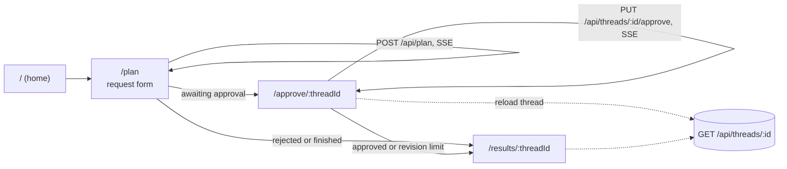

# Frontend Specification

**Version:** 2.0
**Status:** Implemented. This spec describes `frontend/` as it is today: a Next.js 15 app that
walks a traveller from a request form, through live progress and an approval step, to the stored
plan. The first version of this file (2026-09-29) described a different product (Next.js 14, a
marketplace-style design system, Stripe, Playwright and Lighthouse targets). None of that was
built, and it is gone.
**Dependencies:** the API (`05-api`). The types in `frontend/src/lib/types.ts` mirror the plan
document built in `src/agents/plan.py`.

---

## Overview

The browser talks to the FastAPI service directly. It starts a plan with a streaming `POST`,
shows the agents finishing one by one, and then either shows the plan for review (approval step)
or the final result.

**Principles**

- The stored thread is the truth. After any streamed run the page reloads the thread from the
  API instead of trusting what it kept in memory.
- The page never claims something the backend did not say. A rejected request, an unapproved
  plan and sample flight fares are each labelled as such.
- No secret is in the frontend. The only configuration is the public API origin.

---

## 1. Stack and configuration

| Item | Value |
|---|---|
| Framework | Next.js 15.5 (App Router), React 18, TypeScript in strict mode |
| Styling | Tailwind CSS 3 with a few helpers in `globals.css` |
| Path alias | `@/*` maps to `frontend/src/*` |
| Render | A Node server (`npm start`). The routes are dynamic, so it is not a static export. |
| Config | `NEXT_PUBLIC_API_URL` (default `http://localhost:8000`) |

`NEXT_PUBLIC_API_URL` is the public origin of the API, with no trailing slash and no path. It is
baked into the bundle at **build time**, so changing it needs a rebuild and a redeploy
(`frontend/.env.example`, `next.config.js`).

The browser calls the API directly and CORS is set on the backend (`01-config`). Next.js rewrites
are deliberately not used, because a proxy in front of a long-lived event stream buffers it and
the live progress would arrive in one lump.

The Tailwind colour tokens are named `flipkart-blue`, `flipkart-orange`, `flipkart-dark` and
`flipkart-light`, and the card shadow is `shadow-card`. These are colour names kept from an early
design. They are cosmetic: nothing in the app talks to or imitates any shop.

## 2. API client (`src/lib/`)

| File | Role |
|---|---|
| `api.ts` | `streamPlan`, `streamApproval`, `getThread`, `ApiError`, `API_BASE`, request and decision types |
| `sse.ts` | `parseSseBuffer`: splits a stream buffer into frames and returns the JSON of each `data:` line plus the unfinished tail |
| `types.ts` | The plan document, the stream events, the thread response and the form type |
| `format.ts` | Money and date formatting, form validation, the request sentence, agent labels, weather icons |

**Streaming.** `EventSource` cannot send a `POST` body, so `api.ts` uses `fetch` and reads the
response body with a stream reader. A frame that is not valid JSON is skipped and does not end the
stream.

**Errors.** `ApiError` carries the HTTP status. A network failure becomes
`ApiError("Could not reach the Yatra AI server.", 0)`. A non-2xx answer uses the `detail` string
from the body when there is one, and a generic "The server answered N." otherwise. A failure
*inside* a run arrives as an `error` frame, not as an HTTP error.

**Events** (`PlanStreamEvent`), as documented in `05-api`:

| `type` | Payload | Meaning |
|---|---|---|
| `thread` | `thread_id` | The thread that this run belongs to |
| `progress` | `node` | An agent finished |
| `plan` | `plan` | The plan document |
| `approval_required` | `request` | The graph paused and waits for a decision |
| `done` | none | The run ended |
| `error` | `error` | One generic message; the details stay in the server log |

**Calls.**

| Function | Request | Notes |
|---|---|---|
| `streamPlan({message, threadId?})` | `POST /api/plan`, JSON body `{message, thread_id}` | `threadId` continues an existing thread |
| `streamApproval(threadId, {approved, feedback?})` | `PUT /api/threads/{id}/approve`, JSON body `{approved, feedback}` | Resumes the paused graph, so it streams too. Feedback defaults to an empty string. |
| `getThread(threadId)` | `GET /api/threads/{id}` with `cache: "no-store"` | Returns `{thread, history, message_count, plan, approval}` |

## 3. Hooks (`src/hooks/`)

**`usePlanStream`** returns `{loading, error, nodes, start, resume}`.

- `start({message, threadId?})` and `resume(threadId, decision)` share one `run` routine. It
  aborts the previous request, resets the state and reads the stream.
- `nodes` collects the unique node names from `progress` events, in the order they arrive.
- The result of a run is a `PlanRun {threadId, plan, awaitingApproval}`, or `null` when the run
  failed.
- If the stream ends without a `done` frame, a thread id and a plan, the hook reports "The
  connection closed before the plan was finished. Please try again." This covers a dropped
  connection, for example a sleeping free-tier service.
- Unmounting the page aborts the request.

**`useThread(threadId)`** loads the thread and returns `{thread, loading, error, reload}`. The
error has a `message` and a `notFound` flag. A 404 shows "We could not find that trip."

## 4. Pages (`src/app/`)

### `/` (home)

A hero with `SearchBar`, the `CategoryStrip` ("Every plan covers" flights, hotels, weather, budget
and itinerary), six featured destinations as `TripCard` (Paris, Tokyo, Barcelona, Sydney, Dubai,
London, shown with emoji) and a "Get started" link. `SearchBar` and `TripCard` do not call the API:
they link to `/plan` with `destination` (and `departure`) as query parameters.

### `/plan`

A form with these rules, enforced by `validatePlanForm` in `format.ts`:

| Field | Rule |
|---|---|
| Destination | Required, at most 100 characters |
| Departure, return | Required; departure not in the past; return after departure |
| Travellers | 1 to 10 (`MAX_TRAVELLERS`) |
| Total budget (USD) | At least 100 (`MIN_BUDGET_USD`) |
| Preferences | Optional, at most 500 characters (`MAX_NOTES_LENGTH`) |

The backend takes free text, so `buildPlanMessage` writes the form as one sentence and the page
calls `start({message})`. The form reads `destination` and `departure` from the query string, and
a Suspense boundary wraps `useSearchParams`.

While the run is going the page shows `PlanProgress`. When it ends:

| Result | What the page does |
|---|---|
| `plan.status` is `rejected` | Stays on the form with an amber "We could not plan that request" and the reason from the guardrail |
| `awaitingApproval` | Goes to `/approve/<id>` |
| Otherwise | Goes to `/results/<id>` |

### `/approve/[threadId]`

The page loads the thread and picks one state:

| State | What the traveller sees |
|---|---|
| Loading | A skeleton |
| 404 | "Trip not found" |
| Other error | The message and a "Try again" button |
| No plan | "No plan yet" |
| `rejected` | "There is nothing to approve" |
| `approved` | "Plan approved". Nothing has been booked. |
| `revision_limit` | "Revision limit reached". The last draft is kept and is not approved. |
| `awaiting_approval` | The review screen below |

The review screen shows a `RevisionBanner` ("Revised draft N of MAX", the revision note and how
many changes are left; amber when `feedback_applied` is `false`, which means the model could not
apply the changes and the draft is unchanged), a plan summary, and two choices:

- **Approve plan** sends `{approved: true}`.
- **Reject and ask for changes** needs feedback. Empty feedback is blocked on the page ("Tell us
  what you would like to change."); the limit is 1000 characters (`MAX_FEEDBACK_LENGTH`). The
  server enforces the same rule with a 400.

While the run resumes the page shows `PlanProgress` titled "Working on your answer", then reloads
the thread, because the stored thread is the truth. An approval ends on `/results`. A rejection
stays on `/approve` with the revised draft.

### `/results/[threadId]`

A status banner, then the sections of the stored plan:

| Banner | When |
|---|---|
| Green: "You approved this plan. Nothing has been booked." | `approved` |
| Amber | `revision_limit` |
| Blue, with a "Review and approve" link | `awaiting_approval` |
| Amber notice with the reason | `rejected` |

Sections: **Flights** (a "Sample fares ... not live availability" note when `flights.source` is
`mock`), **Hotels** (the error text when the status is not `success`), **Weather**, **Itinerary**
(per-day cards, highlights, notes) and a sticky **Budget** panel. The plan summary text is hidden
for `approved` and `revision_limit` so that it does not repeat the banner. A section that is `null`
in the plan is not shown.

### Layout

`layout.tsx` sets the title "Yatra AI - Smart Travel Planning" and renders `Header`, the page and
`Footer`. The footer says the app drafts a plan to review and does not book or sell anything. The
favicon is `app/icon.svg`.

## 5. Components (`src/components/`)

| Component | Role |
|---|---|
| `Header`, `Footer` | Site navigation (Home, Plan trip) and the project link |
| `SearchBar` | Home form that opens `/plan` with a prefilled destination and date |
| `CategoryStrip`, `TripCard` | Home page content |
| `PlanProgress` | A live list of finished agents with a spinner row; `role="status"` with `aria-live="polite"` |
| `FlightCard` | One flight: airline, times, duration, price per person and the total for the party |
| `HotelCard` | One hotel. The link is rendered only for `http` or `https`, opens in a new tab with `rel="noopener noreferrer"`. |
| `WeatherPanel` | Day cards with temperature, condition and rain, and the packing advice. It states whether the data is a forecast or the same dates last year. |
| `BudgetBreakdown` | Category bars, the suggested total, whether flights fit the budget, and a note that the non-flight categories are a standard split, not price quotes |
| `LoadingSkeleton` | Placeholder lines while a thread loads |

`format.ts` also maps the nine graph nodes to plain labels in `agentLabel`, for example
`supervisor` to "Understood your request", `flight` to "Searched flights" and `human_approval` to
"Recorded your decision".

Accessibility basics in the code: labelled form fields, `aria-live` on progress, `aria-hidden` on
decorative emoji, and screen-reader text on links that open a new tab. No audit with an
accessibility tool has been run.

## 6. Tests and checks

There are **no automated frontend tests**. `package.json` lists `jest`, `@testing-library` and
`@playwright/test` with `test` and `test:e2e` scripts, but there is no test file and no Jest or
Playwright configuration, so those scripts do nothing useful today.

What does check the frontend:

- `next build` compiles every page and runs the TypeScript type check (strict mode). The
  `verify.yml` workflow runs it as "Tier 3". That workflow deletes `package-lock.json` first, so it
  tests whatever versions npm resolves on the day. Render builds with `npm ci` and the lockfile.
- A manual browser run in this repository's last work session. A production build of the frontend
  talked to the real API and a real PostgreSQL checkpointer; the LLM, the supervisor and the three
  network tools were faked. The flows covered were the plan form, live progress, the redirect to
  the approval page, an empty rejection being blocked, a rejection with feedback giving "Revised
  draft N of 3", the cap of three revisions ending in "Revision limit reached", approval, and the
  results page banners and weather. The network trace and the browser console showed no errors. No
  screenshots were kept.

## 7. Known gaps

- The UI has never been run against a real LLM. The text a real model writes is not checked here.
- No automated frontend tests, no accessibility audit, no bundle-size or Lighthouse numbers. No
  such figure is claimed.
- `recharts` and `zod` are listed as dependencies and no code imports them. `public/logo.svg`
  exists and nothing references it. They can be removed without any change in behaviour.
- The `verify.yml` frontend step does not use the lockfile (see section 6).
- The plan is stored by thread id and there is no login, so anyone who has the link can open the
  plan and answer the approval (`04-memory`, section 5).
- Flights are sample data and the page says so; the first-draft itinerary is a template and only
  revisions are written by the model.
- The server-sent events have not been tried through Render's free-tier proxy.
